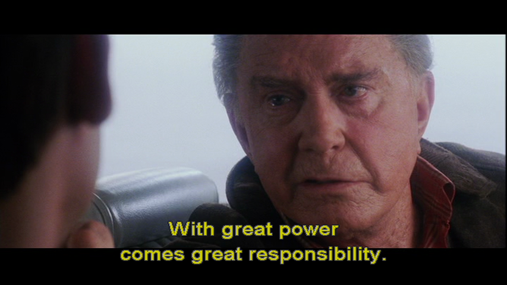
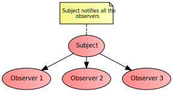
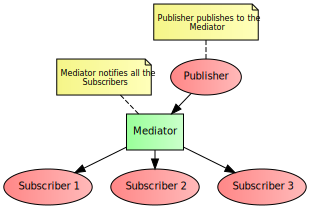

<!--

WARNING!! DON'T EDIT THE FILE README.md on the root of the project, that one is a GENERATED FILE!

You should just edit the source file at src/README.md - the one which stars with ## Design patterns for JS

-->

## Design patterns for JS
### featuring modules
</p>

Tiago Garcia @ [Women Who Code SF](https://www.meetup.com/Women-Who-Code-SF/) - Oct 27th, 2016

---

## Tiago Garcia

<p class="ac-column-logo">
  
</p>

<ul class="ac-column-text">
  <li>JavaScript P.I., dog daddy, vegetarian rollerblader,<br/>not your typical Brazilian.</li>
  <li>Tech Manager at [Avenue Code](http://www.avenuecode.com)</li>
  <li>Tech Lead at [Macys.com](http://www.macys.com)</li>
  <li>Twitter: [@tiagooo_romero](https://twitter.com/tiagooo_romero)</li>
  <li>Site: *[tiagorg.com](http://tiagorg.com)*</li>
  <li>*[tgarcia@avenuecode.com](mailto:tgarcia@avenuecode.com)*</li>
</ul>

----


---

## Agenda

- Patterns and Design Patterns
- JavaScript Design Patterns
    - Constructor
    - Fa&ccedil;ade
    - Module
      - CommonJS
      - AMD
      - ES2015
    - Observer aka Custom Event
    - Mediator aka Pub-Sub

---

## Patterns

- Pattern:
    - Proven *solution* to a certain class of *problems* in a specific *context*
    - Pre-conditions -> requirements
    - Post-conditions -> consequences
- Pattern *language*: a common vocabulary
- *Network* of connected patterns -> reuse

----

## Design Patterns

- Design Patterns address common OOP problems.
- 1994: *Gang Of Four* publishes [Design Patterns](http://www.amazon.com/Design-Patterns-Object-Oriented-Professional-Computing/dp/0201634988), a critical turning point in the history of OOP.
   - Features 23 classic design patterns, categorized in *creational*, *structural* and *behavioral*.
   - Many believe that "Design Patterns" term is exclusive to those 23 patterns -> not the case

----

## Design Patterns

- Back in 1994, programming languages' native support to Design Patterns was hazy.
- Nowadays, many of those patterns have been incorporated into programming languages and frameworks.

---

## JS Design Patterns

- JS code is more complex today than ever before.
   - Dazzling experience & interaction
   - Async calls, Callbacks, Promises
   - Single Page Applications
- Good reasons to use Design Patterns in JS:
   - Avoid "spaghetti code" (unstructured/hard to read).
   - Better overall maintainability, making it clear where to change the code.
   - Far more objective unit tests.
- Today we are covering some of the work of [Stoyan Stefanov](https://twitter.com/stoyanstefanov) and [Addy Osmani](https://twitter.com/addyosmani).

----

## Remember Uncle Ben!



---

## Constructor

- *Creational* pattern
- Purpose: to initialize a newly created object once memory has been allocated.
- Pre-condition: a definition for the object
- Post-condition: a customized object allocated in the memory

----

## Constructor

- JS is indeed OO but it differs from classic OO, and there are different ways to construct an object:
```javascript
  // object literal a.k.a. Singleton
  var myDog = {};

  // ES5 Object.create method from prototype
  var myDog = Object.create(Dog.prototype);

  // constructor call
  var myDog = new Dog();
```

----

## Basic Constructor

- *new* must be used before invoking.
- *this* references the new object being created.
- Returns a new instance, no need for *return*.

```javascript
  function Dog(name, breed) {
    this.name = name;
    this.breed = breed;
    this.bark = function() {
      return this.name + ': woof, woof!';
    };
  }

  var myDog = new Dog('Sherlock', 'beagle');
  console.log(myDog.bark());
```
<p class="center">[view on Plunker](http://plnkr.co/edit/ARySm1?p=preview)</p>

----

## Prototype

- Defining a method in the constructor is bad, as each new instance will contain a definition for the method.
- By writing on the function's *prototype*, all instances can share the same definition of a method.

```javascript
  function Dog(name, breed) {
    this.name = name;
    this.breed = breed;
  }
  Dog.prototype.bark = function() {
    return this.name + ': woof, woof!';
  };

  var myDog = new Dog('Sherlock', 'beagle');
  console.log(myDog.bark());
```


----

## ES2015 Classes

- ES2015 introduced some syntax sugar to make this easier to code and more straightforward to read.

```javascript
  class Dog {
    constructor(name, breed) {
      this.name = name;
      this.breed = breed;
    }

    bark() {
      return `${this.name}: woof, woof!`;
    }
  }

  var myDog = new Dog('Sherlock', 'beagle');
  console.log(myDog.bark());
```

<p class="center">[view on Plunker](http://plnkr.co/edit/xSNeLd?p=preview)</p>

---

## Fa&ccedil;ade

- *Structural* pattern
- Purpose: to provide a convenient high-level interface to a component, hiding its underlying complexity.
- Represents one of the main principles from GoF: "Program to an interface, not an implementation".
- Pre-condition: a complex, low-level code chunk
- Post-condition: a simplified, high-level interface

----

## Fa&ccedil;ade

- Example: printing out a JSON from the server

```javascript
  function ajax(url, callback) {
    let xhr = new XMLHttpRequest();
    xhr.onload = function() {
      if (this.status === 200) {
        callback(JSON.parse(this.responseText));
      }
    };
    xhr.open('GET', url, true);
    xhr.send();
  }

  ajax('http://swapi.co/api/planets/1/', console.log);
```

<p class="center">[view on Plunker](http://plnkr.co/edit/bqCCAq?p=preview)</p>

----

## IIFE

- Self-invoked function, keeps internal variables and functions as private, within its closure.

```javascript
var getCurrentWeather = (function() {
  function generateResponse(useMetric, data) {
    var unit = `°${useMetric? 'C': 'F'}`;
    console.log(`${data.weather[0].main}. Now ${data.main.temp}${unit}.`);
  }
  return function(city, country, useMetric) {
    var unit = useMetric ? 'metric' : 'imperial';
    var url = `http://api.openweathermap.org/data/2.5/weather?q=${city},${country}&units=${unit}&APPID=c48ddbf104363ec75645b36b470559fc`;
    ajax(url, generateResponse.bind(undefined, useMetric));
  }
})();
```

```javascript
getCurrentWeather('San Francisco', 'US', false);
getCurrentWeather('Paris', 'FR', true);
```
<p class="center">[view on Plunker](http://plnkr.co/edit/u3xVQh?p=preview)</p>

---

## Challenge 1

- Fork from [http://plnkr.co/edit/u3xVQh?p=preview](http://plnkr.co/edit/u3xVQh?p=preview)
- Take a moment to understand this implementation.
- Write a class *`Location`* whose constructor receives 3 attributes: *`city`*, *`country`* and *`useMetric`*.
- Under *`Location`*, write a method *`getMyCurrentWeather(printFn)`*, which will call *`getCurrentWeather`* behind the scenes.
- Now, replace the 2 invocations to get weather from San Francisco and Paris with 2 instances of *`Location`*, one for each city, where you will call its method *`getMyCurrentWeather`*.

---

## Module

- *Structural* pattern
- Purpose: to define reusable components with private/public attributes and methods.
- Encapsulation through *closures*, using function scope.
- Pre-condition: a chunk of code with a return point
- Post-condition: a module definition that encapsulates that chunk of code

----

## Module

```javascript
  var Zoo = (function() {
    var getBarkStyle = function(isHowler) {
      return isHowler? 'woooooow!': 'woof, woof!';
    };
    return {
      Dog: function(name, breed) {
        this.name = name;
        this.bark = getBarkStyle(breed === 'husky');
      },
      Wolf: function(name) {
        this.name = name;
        this.bark = getBarkStyle(true);
      }
    };
  })(); // IIFE
```

```javascript
var myDog = new Zoo.Dog('Sherlock', 'beagle');
console.log(myDog.name + ': ' + myDog.bark); // Sherlock: woof, woof!
```
<p class="center">[view on Plunker](http://plnkr.co/edit/JEgEpo?p=preview)</p>

----

## Revealing Module

- Flexibility to switch items from private to public scope.
```javascript
  let Zoo = (function() {
    let getBarkStyle = isHowler => isHowler ? 'woooooow!' : 'woof, woof!';
    let Dog = function(name, breed) {
      this.name = name;
      this.bark = getBarkStyle(breed === 'husky');
    };
    let Wolf = function(name) {
      this.name = name;
      this.bark = getBarkStyle(true);
    };
    return {
      Dog: Dog,
      Wolf: Wolf
    };
  })(); // IIFE
```

<p class="center">[view on Plunker](http://plnkr.co/edit/wptpQ5?p=preview)</p>

----

## Why to use Modules?

- Global JS is bad for performance, reusability, readability, code organization and allows side-effects.
- A module can be delivered as a dependency for another module.
- Modules can be packaged and deployed separately from each other, mitigating the "butterfly effect".
- Modules bring cohesion up and coupling down.

----

## Module loaders

- On the previous example, *Zoo* is a global var, which is:
  - fragile (any posterior code can modify/redefine it)
  - not scalable (what if you define 100 modules?)
  - counter-productive (you have to manually resolve your dependencies)
- Enter *module loaders*:
  - Container for module registration under aliases
  - Dependency injection
  - Modules loading on demand
- Included with your Module standard of choice!

---

## CommonJS

- A standard for *synchronous* modules.
- Pros:
  - Official Node.js and NPM format.
  - Simple and convenient syntax.
  - Guaranteed order of execution of modules.
- Cons:
  - Doesn't naturally work on the browser (there are solutions for that as *Browserify* and *Webpack*).
  - Sequential loading of modules is slower than asynchronous.
  - NPM dependency tree can skyrocket easily.

----

## CommonJS

- Export your module interface with *module.exports*
- Import on the client using *require(dependency)*
```javascript
  // zoo.js
  let getBarkStyle = isHowler => isHowler ? 'woooooow!' : 'woof, woof!';
  let Dog = function(name, breed) {
    this.name = name;
    this.bark = getBarkStyle(breed === 'husky');
  };
  let Wolf = function(name) {
    this.name = name;
    this.bark = getBarkStyle(true);
  };
  module.exports = {
    Dog: Dog,
    Wolf: Wolf
  };
```

----

## CommonJS

```javascript
// client.js
let Zoo = require('./zoo');

let myDog = new Zoo.Dog('Sherlock', 'beagle');
console.log(`${myDog.name}: ${myDog.bark}`); // Sherlock: woof, woof!
```
<p class="center">[view on Plunker](http://plnkr.co/edit/m0UXQg?p=preview)</p>

---

## AMD

- A standard for *asynchronous* modules.
- Pros:
  - Multiple modules can be loaded in parallel.
  - It naturally works on the browser.
  - Easy to lazy-load modules.
- Cons:
  - Complex, easy to create race conditions.
  - Not guaranteed order of execution of modules.
  - Dependencies array gets hard to read easily.

----

## AMD (Require.js)

- Export your module interface with *define()*
- Import on the client using *require()*
```javascript
  // zoo.js
  define('zoo', [], function() {
    let getBarkStyle = isHowler => isHowler ? 'woooooow!' : 'woof, woof!';
    let Dog = function (name, breed) {
      this.name = name;
      this.bark = getBarkStyle(breed === 'husky');
    };
    let Wolf = function (name) {
      this.name = name;
      this.bark = getBarkStyle(true);
    };
    return {
      Dog: Dog,
      Wolf: Wolf
    };
  });
```

----

## AMD

```javascript
// client.js
require(['zoo'], function(Zoo) {
  let myDog = new Zoo.Dog('Sherlock', 'beagle');
  console.log(`${myDog.name}: ${myDog.bark}`); // Sherlock: woof, woof!
});
```

<p class="center">[view on Plunker](http://plnkr.co/edit/VVmdjt?p=preview)</p>

---

## ES2015 Modules

- ES2015 offers native Modules which are quite a bit similar to CommonJS.
```javascript
  // zoo.js
  let getBarkStyle = isHowler => isHowler ? 'woooooow!' : 'woof, woof!';

  export function Dog(name, breed) {
    this.name = name;
    this.bark = getBarkStyle(breed === 'husky');
  };
  export function Wolf(name) {
    this.name = name;
    this.bark = getBarkStyle(true);
  };
```

----

## ES2015 Modules

```javascript
// client.js
import { Dog, Wolf } from './zoo';

console.log(`${myDog.name}: ${myDog.bark}`); // Sherlock: woof, woof!
```

<p class="center">[view on Plunker](http://plnkr.co/edit/sfv37R?p=preview)</p>

- ES2015 Modules are not yet natively supported by browsers & Node.js.
- You can use it right now with a transpiler as [Babel.js](https://babeljs.io/).
- Consider a module loader such as [System.js](https://github.com/systemjs/systemjs), which supports AMD, CommonJS, ES2015 and global.

---

## Challenge 2

- Fork from your Challenge 1 solution or [http://plnkr.co/edit/mn8xjax2xwQwjuWpQUsK?p=preview](http://plnkr.co/edit/mn8xjax2xwQwjuWpQUsK?p=preview)
- Break the code down in 3 ES2015 modules, each module in a separated file:
  - *`Location.js`*
  - *`getCurrentWeather.js`*
  - *`main.js`*
- When exporting/importing a single item:
  - Export: *`export default Module`*
  - Import: *`import Module from ...`*

---

## Observer/Custom Event

- A *Subject* object maintains a list of interested *Observer* objects, automatically notifying them of its changes.



----

## Observer/Custom Event

```javascript
// subject.js
var Subject = function() {
  this.observers = [];
};

Subject.prototype.notify = function(message) {
  this.observers.forEach(function(observer) {
    observer.call(observer, message);
  });
};

Subject.prototype.addObserver = function(observer) {
  this.observers.push(observer);
};

module.exports = Subject;
```

----

## Observer/Custom Event

```javascript
var Subject = require('./subject');
var ball = new Subject();
var human = new Subject();

// register the animals (observers)
var dog = function(message) {
  if (message === 'ball') {
    console.log('The dog ran after the ' + message);
  }
};
ball.addObserver(dog); human.addObserver(dog);

var cat = function(message) {
  console.log('The cat looked and ignored the ' + message);
};
ball.addObserver(cat); human.addObserver(cat);
```

----

## Observer/Custom Event

```javascript
// throw a ball (subject)
console.log('Throwing a ball...');
ball.notify('ball');
// The dog ran after the ball
// The cat looked and ignored the ball

// throw a human (subject)
console.log('Throwing a human...');
human.notify('human');
// The cat looked and ignored the human
```
<p class="center">[source code subject.js](https://github.com/tiagorg/design-patterns-examples/blob/master/observer/subject.js)</p>
<p class="center">[source code client.js](https://github.com/tiagorg/design-patterns-examples/blob/master/observer/client.js)</p>

- Notifier is called -> all the observers will execute.
- *Reduced coupling:* Observers and Subject can live without each other, but the Subject has references to the Observers.

---

## Mediator/Pub-Sub

- Exposes an unified interface through which the different parts of a system may communicate.
- Observer can cause Garbage Collection issues: if removing a Subject, you must remember to remove all the Observer references from it.
- A *Mediator* can completely decouple Subject and Observers by introducing a intermediate layer in between.

----

## Mediator/Pub-Sub



----

## Mediator/Pub-Sub

```javascript
// mediator.js
var channels = {};
var subscribe = function(channel, subscriber) {
  if (!channels[channel]) channels[channel] = [];
  channels[channel].push(subscriber);
};
var publish = function(channel, message){
  if (!channels[channel]) return;
  channels[channel].forEach(function(subscriber) {
    subscriber.call(subscriber, message);
  });
};

module.exports = {
  subscribe: subscribe,
  publish: publish
};
```

----

## Mediator/Pub-Sub

```javascript
// pets.js
var mediator = require('./mediator');

// register the animals (subscribers to 'pets')
var dog = function(message) {
  if (message === 'ball') {
    console.log('The dog ran after the ' + message);
  }
};
mediator.subscribe('pets', dog);

var cat = function(message) {
  console.log('The cat looked and ignored the ' + message);
};
mediator.subscribe('pets', cat);
```

----

## Mediator/Pub-Sub

``` javascript
// client.js
require('./pets');

var mediator = require('./mediator');

// throw a ball (publish to 'pets')
console.log('Throwing a ball...');
mediator.publish('pets', 'ball');
// The dog ran after the ball
// The cat looked and ignored the ball

// throw a human (publish to 'pets')
console.log('Throwing a human...');
mediator.publish('pets', 'human');
// The cat looked and ignored the human
```
<p class="center">[source code mediator.js](https://github.com/tiagorg/design-patterns-examples/blob/master/mediator/mediator.js)</p>
<p class="center">[source code pets.js](https://github.com/tiagorg/design-patterns-examples/blob/master/mediator/pets.js)</p>
<p class="center">[source code client.js](https://github.com/tiagorg/design-patterns-examples/blob/master/mediator/client.js)</p>

----

## Mediator/Pub-Sub

- Same Observers, same event triggering.
- The Mediator is required on both sides.
- Observers and Subject hold no references to each other.
- The Mediator is on top of the control. It is serving as a Pub-Sub infrastructure for those components.

---

## Learn more

- [Check out the examples code](https://github.com/tiagorg/design-patterns-examples)
- [Javascript Patterns - Stoyan Stefanov](http://shop.oreilly.com/product/9780596806767.do)
- [Learning JavaScript Design Patterns - Addy Osmani](http://addyosmani.com/resources/essentialjsdesignpatterns)
- [The mind-boggling universe of JavaScript Module strategies](https://www.airpair.com/javascript/posts/the-mind-boggling-universe-of-javascript-modules)

---

# Questions?


---

# Thanks!

- Special thanks to Avenue Code, Women Who Code crew and most importantly all the attendees!
- Talk: [tiagorg.com/talk-design-patterns-for-javascript-featuring-modules](http://tiagorg.com/talk-design-patterns-for-javascript-featuring-modules)
- Github: [github.com/tiagorg/talk-design-patterns-for-javascript-featuring-modules](https://github.com/tiagorg/talk-design-patterns-for-javascript-featuring-modules)
- More talks at [tiagorg.com](http://tiagorg.com)
- Follow me at [@tiagooo_romero](https://twitter.com/tiagooo_romero)